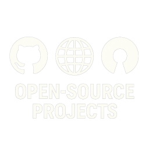

<!-- Improved compatibility of back to top link: See: https://github.com/othneildrew/Best-README-Template/pull/73 -->

<a id="readme-top"></a>

<!--
*** Thanks for checking out the Best-README-Template. If you have a suggestion
*** that would make this better, please fork the repo and create a pull request
*** or simply open an issue with the tag "enhancement".
*** Don't forget to give the project a star!
*** Thanks again! Now go create something AMAZING! :D
-->

<!-- PROJECT SHIELDS -->
<!--
*** I'm using markdown "reference style" links for readability.
*** Reference links are enclosed in brackets [ ] instead of parentheses ( ).
*** See the bottom of this document for the declaration of the reference variables
*** for contributors-url, forks-url, etc. This is an optional, concise syntax you may use.
*** https://www.markdownguide.org/basic-syntax/#reference-style-links
-->

[![Contributors][contributors-shield]][contributors-url]
[![Forks][forks-shield]][forks-url]
[![Stargazers][stars-shield]][stars-url]
[![Issues][issues-shield]][issues-url]
[![MIT License][license-shield]][license-url]

<!-- PROJECT LOGO -->
<br />
<div align="center">
  <a href="https://github.com/LoveDoLove/open-source-projects">
    
  </a>

<h3 align="center">Open Source Projects Showcase</h3>

  <p align="center">
    A dynamic web application that showcases and displays open source projects in an elegant, responsive interface
    <br />
    <a href="https://github.com/LoveDoLove/open-source-projects"><strong>Explore the docs »</strong></a>
    <br />
    <br />
    <a href="https://open-source-projects.pages.dev">View Demo</a>
    ·
    <a href="https://github.com/LoveDoLove/open-source-projects/issues/new?labels=bug&template=bug-report---.md">Report Bug</a>
    ·
    <a href="https://github.com/LoveDoLove/open-source-projects/issues/new?labels=enhancement&template=feature-request---.md">Request Feature</a>
  </p>
</div>

<!-- TABLE OF CONTENTS -->
<details>
  <summary>Table of Contents</summary>
  <ol>
    <li>
      <a href="#about-the-project">About The Project</a>
      <ul>
        <li><a href="#built-with">Built With</a></li>
      </ul>
    </li>
    <li>
      <a href="#getting-started">Getting Started</a>
      <ul>
        <li><a href="#prerequisites">Prerequisites</a></li>
        <li><a href="#installation">Installation</a></li>
      </ul>
    </li>
    <li><a href="#usage">Usage</a></li>
    <li><a href="#features">Features</a></li>
    <li><a href="#roadmap">Roadmap</a></li>
    <li><a href="#contributing">Contributing</a></li>
    <li><a href="#license">License</a></li>
    <li><a href="#contact">Contact</a></li>
    <li><a href="#acknowledgments">Acknowledgments</a></li>
  </ol>
</details>

<!-- ABOUT THE PROJECT -->

## About The Project

The Open Source Projects Showcase is a dynamic web application designed to elegantly display and organize open source projects. Built with modern web technologies and deployed on Cloudflare Workers, this project provides a clean, responsive interface for browsing project collections.

Key highlights:
* **Dynamic Project Loading**: Fetches project data from JSON files and renders them dynamically
* **Responsive Design**: Clean, modern interface that works across all devices
* **Cloudflare Workers Integration**: Fast, global deployment with edge computing capabilities
* **Easy Project Management**: Simple JSON-based project data management
* **GitHub Integration**: Direct links to project repositories and live demos

This project serves as both a functional showcase platform and a template for developers looking to create their own project portfolio sites.

<p align="right">(<a href="#readme-top">back to top</a>)</p>

### Built With

* [![HTML5][HTML5]][HTML5-url]
* [![CSS3][CSS3]][CSS3-url]
* [![JavaScript][JavaScript]][JavaScript-url]
* [![Cloudflare Workers][Cloudflare]][Cloudflare-url]
* [![Node.js][Node.js]][Node-url]

<p align="right">(<a href="#readme-top">back to top</a>)</p>

<!-- GETTING STARTED -->

## Getting Started

To get a local copy up and running, follow these simple steps.

### Prerequisites

You'll need Node.js and npm installed on your machine. We recommend using the latest LTS version.

* npm
  ```sh
  npm install npm@latest -g
  ```

* Cloudflare Wrangler CLI (for deployment)
  ```sh
  npm install -g wrangler
  ```

### Installation

1. Clone the repository
   ```sh
   git clone https://github.com/LoveDoLove/open-source-projects.git
   ```

2. Navigate to the project directory
   ```sh
   cd open-source-projects
   ```

3. Install NPM packages
   ```sh
   npm install
   ```

4. Start the development server
   ```sh
   npm run dev
   ```

5. Open your browser and visit `http://localhost:8787` to view the application

6. (Optional) To deploy to Cloudflare Workers:
   ```sh
   npm run deploy
   ```

<p align="right">(<a href="#readme-top">back to top</a>)</p>

<!-- USAGE EXAMPLES -->

## Usage

### Adding New Projects

To add new projects to the showcase, edit the `public/data/projects.json` file:

```json
{
  "name": "Your Project Name",
  "description": "A detailed description of your project and its features.",
  "github_url": "https://github.com/username/repository",
  "hostname": "your-project.example.com"
}
```

### Project Data Structure

Each project object supports the following fields:
- `name`: The display name of the project
- `description`: A brief description of the project's purpose and features
- `github_url`: Link to the GitHub repository
- `hostname`: (Optional) Link to the live demo or project website

### Customization

The application's styling can be customized by modifying the CSS in the `<style>` section of `public/index.html`. The design is fully responsive and uses a card-based layout.


### Development & Deployment Workflow

1. **Local Development**: Use `npm run dev` to start a local development server
2. **Testing**: Make changes and test them locally before deployment
3. **Cloudflare Workers Deployment**: Use `npm run deploy` to publish changes to Cloudflare Workers
4. **GitHub Pages Deployment**: The static website in the `public` folder is automatically published to GitHub Pages by a GitHub Actions workflow. This workflow runs after the `Fetch Repo Metadata` workflow completes successfully on the `main` branch. No local installation of `gh-pages` is required; the deployment is handled entirely by GitHub Actions using `npx gh-pages`.

#### How GitHub Pages Deployment Works

- The workflow `.github/workflows/deploy-pages.yml` is triggered after `.github/workflows/fetch-repo-metadata.yml` completes successfully.
- It checks out the repository, installs dependencies, and runs `npx gh-pages -d public` to publish the contents of the `public` directory to the `gh-pages` branch.
- The site is then available via GitHub Pages for this repository.

> **Note:** You do not need to run any deployment commands locally for GitHub Pages. All publishing is automated via GitHub Actions.

_For more detailed examples and API documentation, please refer to the [Documentation](https://github.com/LoveDoLove/open-source-projects/wiki)_

<p align="right">(<a href="#readme-top">back to top</a>)</p>

<!-- FEATURES -->

## Features

- **📱 Responsive Design**: Works seamlessly on desktop, tablet, and mobile devices
- **⚡ Fast Loading**: Powered by Cloudflare Workers for global edge performance
- **🔄 Dynamic Content**: Projects are loaded dynamically from JSON data
- **🎨 Modern UI**: Clean, professional interface with smooth transitions
- **🔗 GitHub Integration**: Direct links to repositories and live demos
- **📋 Easy Management**: Simple JSON-based project data management
- **🚀 One-Click Deployment**: Deploy to Cloudflare Workers with a single command
- **🔍 Error Handling**: Graceful error handling and loading states
- **♿ Accessibility**: Built with accessibility best practices in mind

<p align="right">(<a href="#readme-top">back to top</a>)</p>

<!-- ROADMAP -->

## Roadmap

- [x] Basic project showcase functionality
- [x] Responsive design implementation
- [x] Cloudflare Workers deployment
- [ ] Search and filter functionality
- [ ] Project categories and tags
- [ ] Admin interface for project management
- [ ] Analytics and visitor tracking
- [ ] Dark mode support
- [ ] Multi-language support
- [ ] Project statistics integration

See the [open issues](https://github.com/LoveDoLove/open-source-projects/issues) for a full list of proposed features (and known issues).

<p align="right">(<a href="#readme-top">back to top</a>)</p>

<!-- CONTRIBUTING -->

## Contributing

Contributions are what make the open source community such an amazing place to learn, inspire, and create. Any contributions you make are **greatly appreciated**.

If you have a suggestion that would make this better, please fork the repo and create a pull request. You can also simply open an issue with the tag "enhancement".
Don't forget to give the project a star! Thanks again!

1. Fork the Project
2. Create your Feature Branch (`git checkout -b feature/AmazingFeature`)
3. Commit your Changes (`git commit -m 'Add some AmazingFeature'`)
4. Push to the Branch (`git push origin feature/AmazingFeature`)
5. Open a Pull Request

### Development Guidelines

- Follow existing code style and formatting
- Add comments for complex functionality
- Test your changes locally before submitting
- Update documentation as needed
- Ensure responsive design compatibility

<p align="right">(<a href="#readme-top">back to top</a>)</p>

### Top contributors:

<a href="https://github.com/LoveDoLove/open-source-projects/graphs/contributors">
  
</a>

<!-- LICENSE -->

## License

Distributed under the MIT License. See `LICENSE` for more information.

<p align="right">(<a href="#readme-top">back to top</a>)</p>

<!-- CONTACT -->

## Contact

LoveDoLove - [@LoveDoLove](https://github.com/LoveDoLove)

Project Link: [https://github.com/LoveDoLove/open-source-projects](https://github.com/LoveDoLove/open-source-projects)

Live Demo: [https://open-source-projects.pages.dev](https://open-source-projects.pages.dev)

<p align="right">(<a href="#readme-top">back to top</a>)</p>

<!-- ACKNOWLEDGMENTS -->

## Acknowledgments

* [Best-README-Template](https://github.com/othneildrew/Best-README-Template) for the excellent README structure
* [Cloudflare Workers](https://workers.cloudflare.com/) for providing fast, global edge computing
* [Shields.io](https://shields.io/) for the beautiful badges
* [contrib.rocks](https://contrib.rocks/) for the contributor images
* The open source community for inspiration and support

<p align="right">(<a href="#readme-top">back to top</a>)</p>

<!-- MARKDOWN LINKS & IMAGES -->
<!-- https://www.markdownguide.org/basic-syntax/#reference-style-links -->

[contributors-shield]: https://img.shields.io/github/contributors/LoveDoLove/open-source-projects.svg?style=for-the-badge
[contributors-url]: https://github.com/LoveDoLove/open-source-projects/graphs/contributors
[forks-shield]: https://img.shields.io/github/forks/LoveDoLove/open-source-projects.svg?style=for-the-badge
[forks-url]: https://github.com/LoveDoLove/open-source-projects/network/members
[stars-shield]: https://img.shields.io/github/stars/LoveDoLove/open-source-projects.svg?style=for-the-badge
[stars-url]: https://github.com/LoveDoLove/open-source-projects/stargazers
[issues-shield]: https://img.shields.io/github/issues/LoveDoLove/open-source-projects.svg?style=for-the-badge
[issues-url]: https://github.com/LoveDoLove/open-source-projects/issues
[license-shield]: https://img.shields.io/github/license/LoveDoLove/open-source-projects.svg?style=for-the-badge
[license-url]: https://github.com/LoveDoLove/open-source-projects/blob/master/LICENSE
[linkedin-shield]: https://img.shields.io/badge/-LinkedIn-black.svg?style=for-the-badge&logo=linkedin&colorB=555
[linkedin-url]: https://linkedin.com/in/LoveDoLove
[product-screenshot]: https://via.placeholder.com/600x400?text=Open+Source+Projects+Showcase
[HTML5]: https://img.shields.io/badge/html5-%23E34F26.svg?style=for-the-badge&logo=html5&logoColor=white
[HTML5-url]: https://developer.mozilla.org/en-US/docs/Web/HTML
[CSS3]: https://img.shields.io/badge/css3-%231572B6.svg?style=for-the-badge&logo=css3&logoColor=white
[CSS3-url]: https://developer.mozilla.org/en-US/docs/Web/CSS
[JavaScript]: https://img.shields.io/badge/javascript-%23323330.svg?style=for-the-badge&logo=javascript&logoColor=%23F7DF1E
[JavaScript-url]: https://developer.mozilla.org/en-US/docs/Web/JavaScript
[Cloudflare]: https://img.shields.io/badge/Cloudflare-F38020?style=for-the-badge&logo=Cloudflare&logoColor=white
[Cloudflare-url]: https://workers.cloudflare.com/
[Node.js]: https://img.shields.io/badge/node.js-6DA55F?style=for-the-badge&logo=node.js&logoColor=white
[Node-url]: https://nodejs.org/